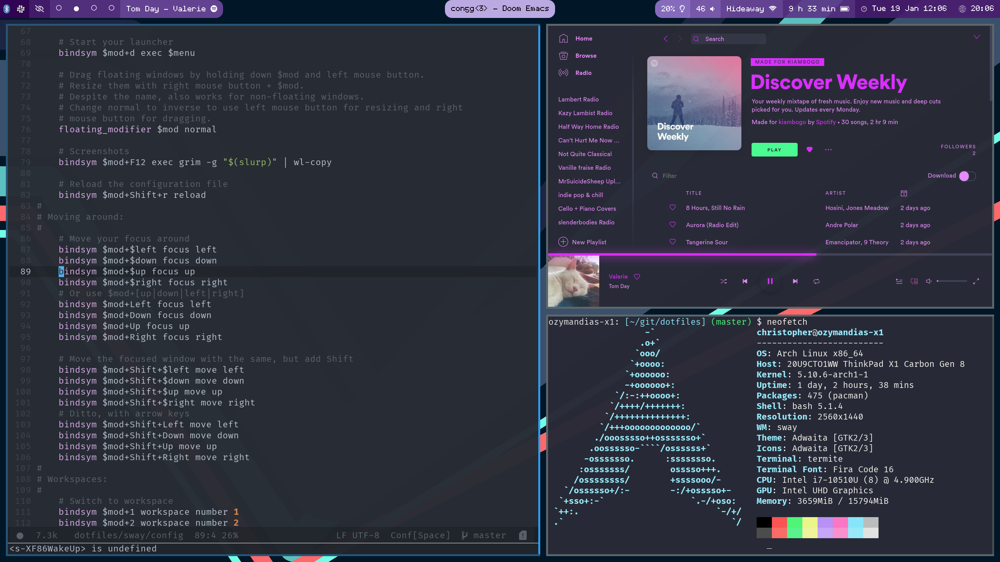

# (dot)files

This repo contains various configuration, scripts, etc for setting up programs and services that I use. I have changed the base programs that I use over the years, so some of these configs are a bit obsolete and will be cleaned up at some point. Tread lightly.

Currently used:
  - sway
  - waybar
  - doom emacs
  - termite
  - spicetify
  - bash

